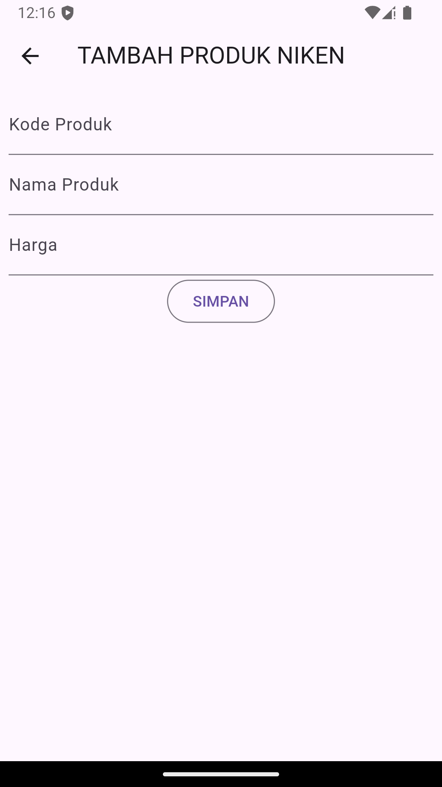
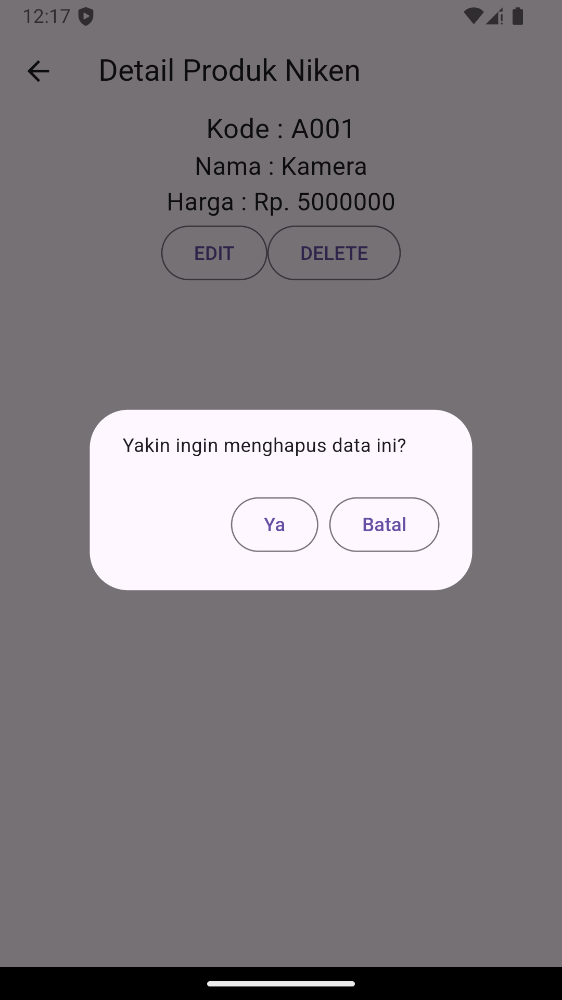

# Pertemuan 4 dan 5

## Pertemuan 4 (hasil)

## Pertemuan 5 (hasil dan penjelasan)
1. Login : Pada halaman login ini terdapat form untuk memasukkan email dan password pengguna. Setelah pengguna memasukkan informasi yang diperlukan dan menekan tombol "Login", aplikasi akan memvalidasi input apakah email dan password sudah diisi dengan benar. Jika validasi berhasil, fungsi `_submit()` akan dijalankan untuk mengirim data login ke server menggunakan `LoginBloc.login`. Jika respons dari server menunjukkan status berhasil (kode 200), aplikasi menyimpan token dan userID di penyimpanan lokal dan mengarahkan pengguna ke halaman produk. Jika login gagal, sebuah dialog peringatan akan ditampilkan. Selain itu, pengguna juga bisa berpindah ke halaman registrasi melalui opsi yang disediakan di bawah form.

2. Registrasi : Pada halaman registrasi, pengguna dapat memasukkan nama, email, dan password untuk mendaftarkan akun. Setelah data diisi dan pengguna menekan tombol "Registrasi", aplikasi akan memvalidasi input pengguna. Nama harus minimal 3 karakter, email harus valid, dan password minimal 6 karakter. Selain itu, pengguna juga harus mengonfirmasi password yang sesuai dengan input sebelumnya. Jika validasi berhasil, fungsi `_submit()` dipanggil untuk mengirim data registrasi ke server melalui `RegistrasiBloc.registrasi`. Jika registrasi berhasil, dialog sukses ditampilkan, mengarahkan pengguna untuk login. Jika gagal, dialog peringatan akan muncul untuk meminta pengguna mencoba lagi.

3. Product : Pada halaman Form Produk, pengguna dapat menambahkan atau mengubah data produk. Saat halaman dibuka, aplikasi akan memeriksa apakah data produk sudah ada (isUpdate). Jika ada, form akan diisi dengan data produk yang ingin diubah; jika tidak, pengguna dapat mengisi form untuk produk baru. Form terdiri dari input kode produk, nama produk, dan harga produk, di mana setiap input memiliki validasi masing-masing. Setelah form diisi dan tombol Simpan atau Ubah ditekan, aplikasi akan memvalidasi input pengguna. Jika valid, data akan dikirim ke ProdukBloc untuk disimpan (untuk produk baru) atau diperbarui (untuk produk yang sudah ada). Proses penyimpanan atau pembaruan akan menampilkan dialog peringatan jika gagal, dan akan mengarahkan pengguna kembali ke halaman daftar produk setelah berhasil.

4. Logout : Pada proses Logout yang terdapat di sidebar, logout menggunakan `LogoutBloc` untuk memproses logout pengguna. Ketika pengguna memilih opsi logout, metode `logout()` di dalam `LogoutBloc` dipanggil. Metode ini memanggil `UserInfo().logout()` yang bertanggung jawab untuk menghapus informasi pengguna yang tersimpan di perangkat (seperti token atau data sesi) agar pengguna benar-benar keluar dari aplikasi. Setelah proses ini selesai, pengguna tidak lagi memiliki akses ke halaman yang memerlukan autentikasi sampai mereka melakukan login kembali.

