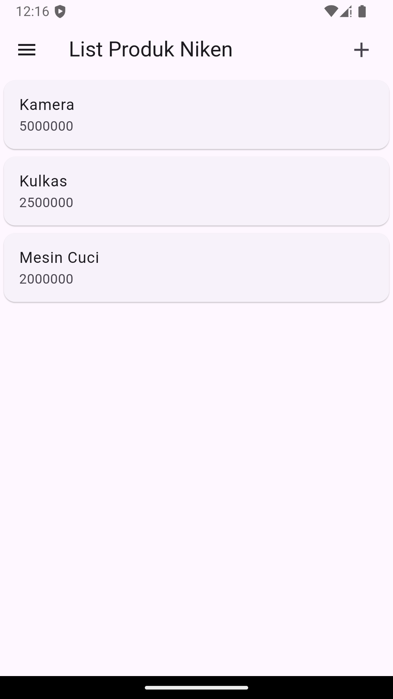
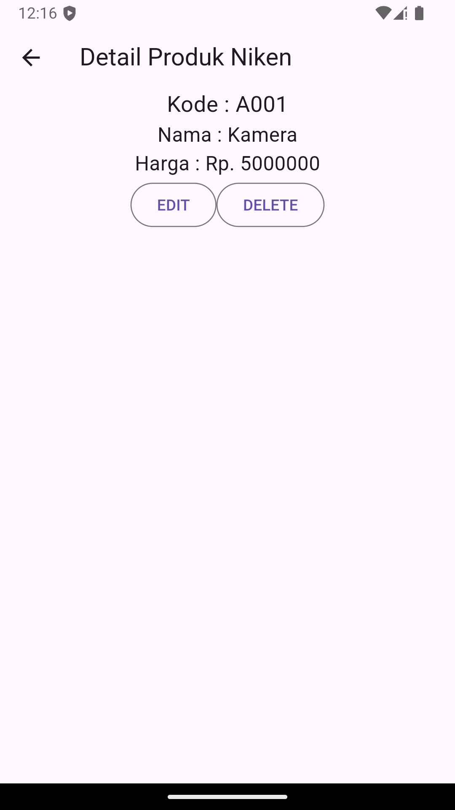
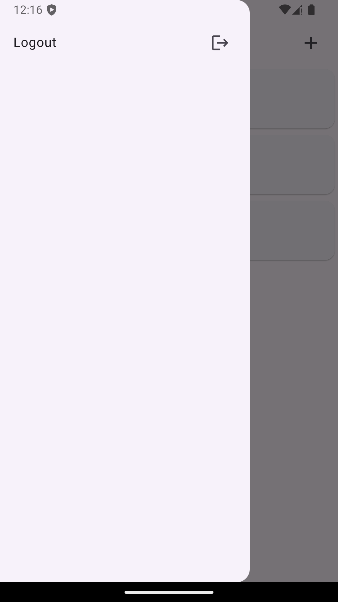

# Pertemuan 4 dan 5

## Pertemuan 4 (hasil)

## Pertemuan 5 (hasil dan penjelasan)
1. Login : Pada halaman login ini terdapat form untuk memasukkan email dan password pengguna. Setelah pengguna memasukkan informasi yang diperlukan dan menekan tombol "Login", aplikasi akan memvalidasi input apakah email dan password sudah diisi dengan benar. Jika validasi berhasil, fungsi `_submit()` akan dijalankan untuk mengirim data login ke server menggunakan `LoginBloc.login`. Jika respons dari server menunjukkan status berhasil (kode 200), aplikasi menyimpan token dan userID di penyimpanan lokal dan mengarahkan pengguna ke halaman produk. Jika login gagal, sebuah dialog peringatan akan ditampilkan. Selain itu, pengguna juga bisa berpindah ke halaman registrasi melalui opsi yang disediakan di bawah form.

2. Registrasi : Pada halaman registrasi, pengguna dapat memasukkan nama, email, dan password untuk mendaftarkan akun. Setelah data diisi dan pengguna menekan tombol "Registrasi", aplikasi akan memvalidasi input pengguna. Nama harus minimal 3 karakter, email harus valid, dan password minimal 6 karakter. Selain itu, pengguna juga harus mengonfirmasi password yang sesuai dengan input sebelumnya. Jika validasi berhasil, fungsi `_submit()` dipanggil untuk mengirim data registrasi ke server melalui `RegistrasiBloc.registrasi`. Jika registrasi berhasil, dialog sukses ditampilkan, mengarahkan pengguna untuk login. Jika gagal, dialog peringatan akan muncul untuk meminta pengguna mencoba lagi.

3. Product

